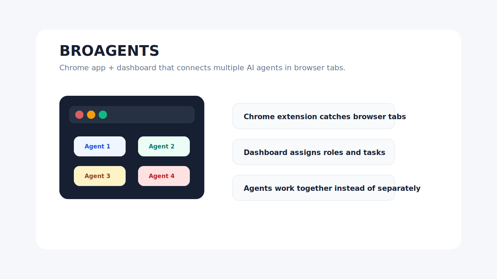

# BROAGENTS Browser AI Runtime



A Chrome app/extension plus dashboard for connecting multiple AI browser agents into one controllable workspace.

## What It Does

BROAGENTS registers AI browser tabs, gives them roles and lets an operator coordinate work across agents from a local control panel. It is built for browser-based AI workflows where several assistants need to share context and stay visible.

## Public Links

- GitHub: https://github.com/KaimiEwl/broagents-browser-ai-runtime
- Portfolio card: https://kaimiewl.github.io/#work
- Architecture notes: `docs/architecture.md`

## Features

- Chrome extension for connecting ChatGPT/Gemini-style tabs
- Local HTTP/WebSocket server
- Dashboard for active agents and scenarios
- Role and task configuration
- Windows launch and reset scripts

## Stack

Node.js, WebSocket, Chrome Extension, React/Vite, PowerShell.

## Run Locally

```bash
npm install
npm start
```

## Check

```bash
node --check server.js
```

## Status

Demo export. Local state, browser sessions, backups, logs and private runtime files are excluded.
